# Links between nodes

### Nodes can be connected with links/edges.

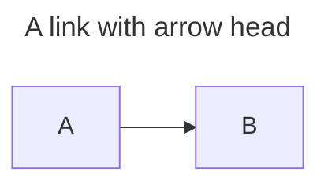
```code
flowchart LR
    A-->B
```

---
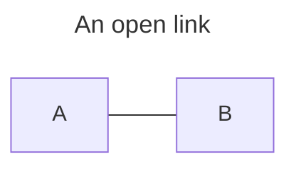
```code
flowchart LR
    A --- B
```

---
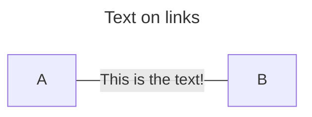
```code
flowchart LR
    A -- This is the text! --- B
```

---
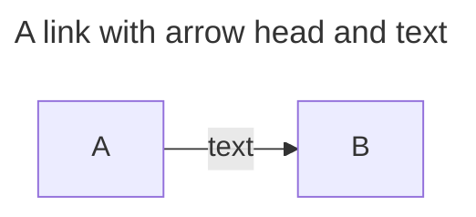
```code
flowchart LR
    A-->|text|B
%% Otra forma
flowchart LR
    A-- text --> B
```

---
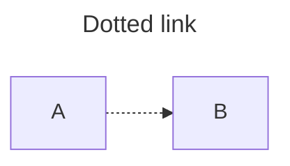
```code
flowchart LR
    A-.->B
```

---
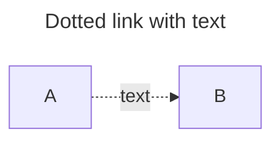
```code
flowchart LR
    A-. text .->B
```

---
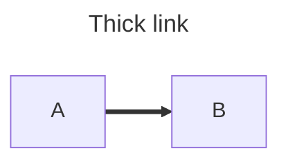
```code
flowchart LR
    A==>B
```

---
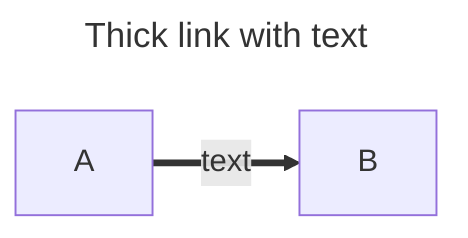
```code
flowchart LR
    A==text==>B
```

---
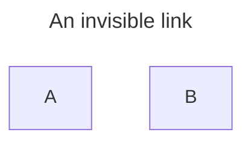
```code
flowchart LR
    A ~~~ B
```
```text
This can be a useful tool in some instances where you want to alter the default positioning of a node.
```

---
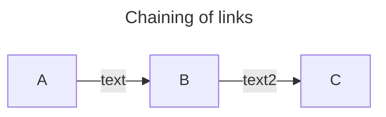
```code
flowchart LR
    A -- text --> B -- text2 --> c
```
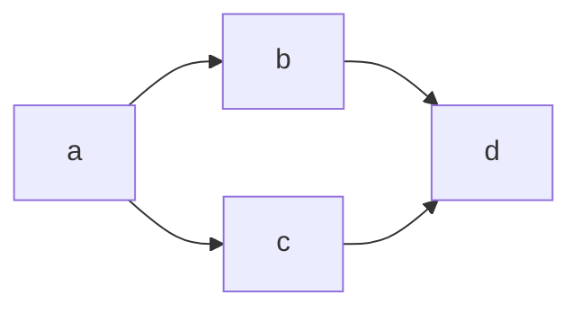
```code
flowchart LR
    a --> b & c --> d
```
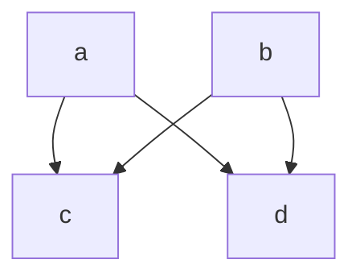

