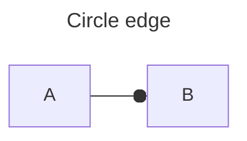
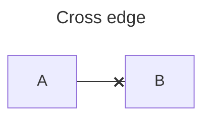
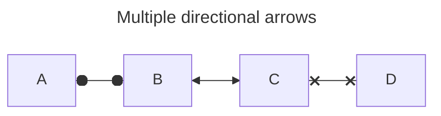
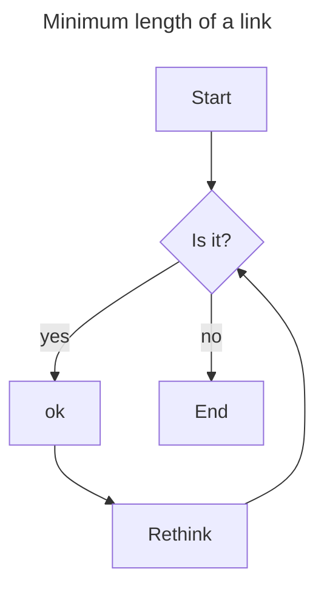
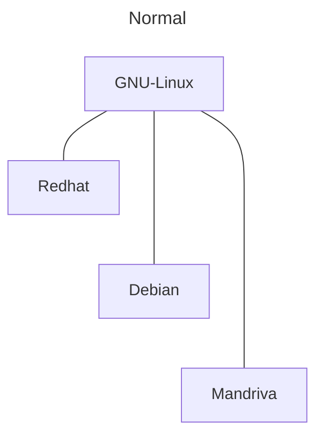
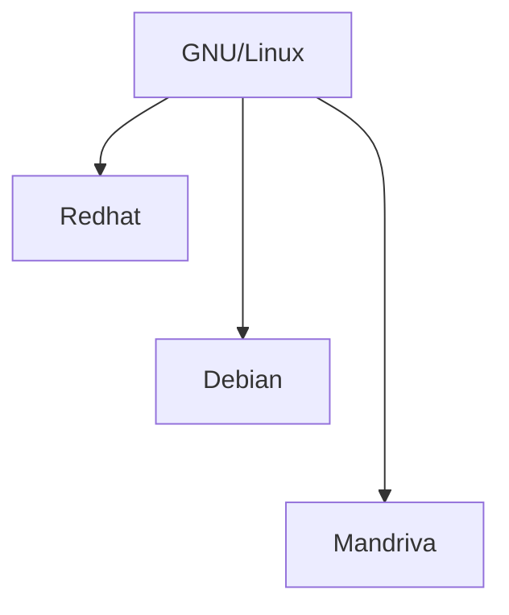
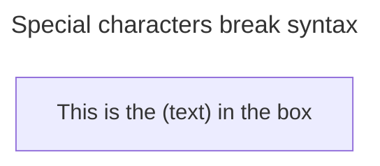
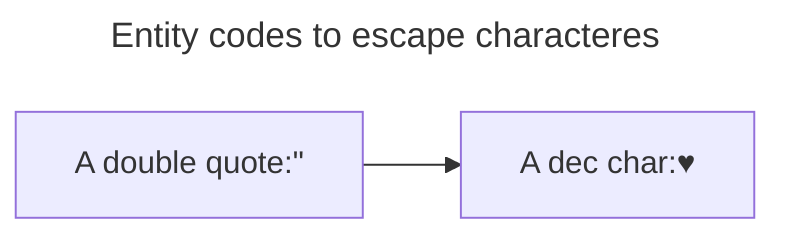

# New arrow types


```code
flowchart LR
    A --o B
````
--- 


```code
flowchart LR
    A --x B
```

--- 


```code
flowchart LR
    A o--O B
    B <--> C
    C x--x D
```

--- 


```code
flowchart LR
    A[Start]-->B{Is it?}
    B--> |yes| C[ok]
    C-->D[Rethink]
    D-->B
    B-->|no| E[End]
```

--- 


```code
flowchart LR
    A[Start]-->B{Is it?}
    B--> |yes| C[ok]
    C-->D[Rethink]
    D-->B
    B-->|no| E[End]
```
```code
flowchart TD
    A[Start] --> B{Is it?}
    B--yes-->C[ok]
    C-->D[Rethink]
    D-->B
    B--no-->E[End]
```

|Length|1|2|3|
|------|-|-|-|
|Normal|---|----|-----|
|Normal with arrow| --> | ---> | ---->|
|thick|===|====|=====|
|thick with arrow|==>|===>|====>|
|Dotted|-.-|-..-|-...-|
|Dotted with arrow|-.->|-..->|-...->|

Examples:



---



--- continuara

---


```code
flowchart LR
    id1["This is the (text) in the box"]
```

---


```code
flowchart LR
    A["A double quote:#quot;"] --> B["A dec char:#9829;"]
```