# Node shapes

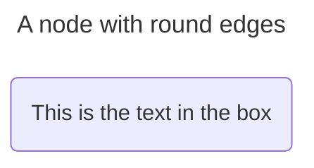
```code
flowchart LR
    id2(This is the text in the box)
```

---

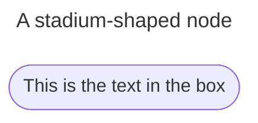
```code
flowchart LR
    id2([This is the text in the box])
```

---

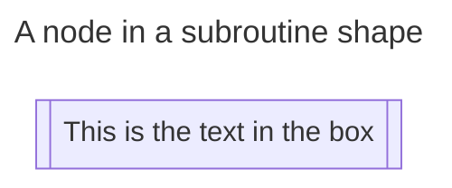

```code
flowchart LR
    id2[[This is the text in the box]]
```

---

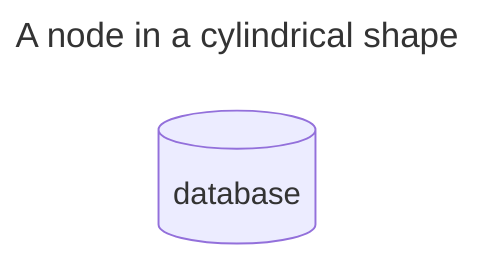

```code
flowchart LR
    id1[(database)]
```

---

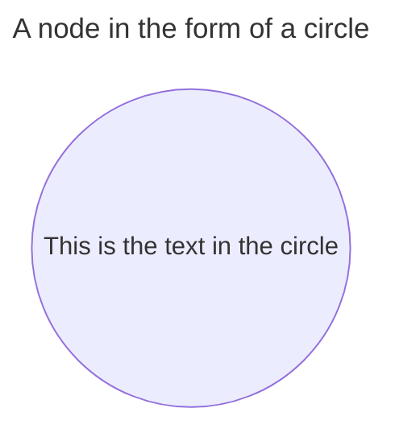

```code
flowchart LR
    id1((This is text in the circle))
```

---

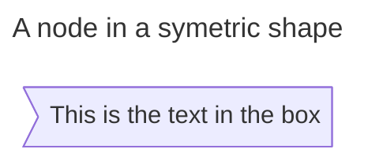

```code
flowchart LR
    id1>This is the text in the box]
```

---

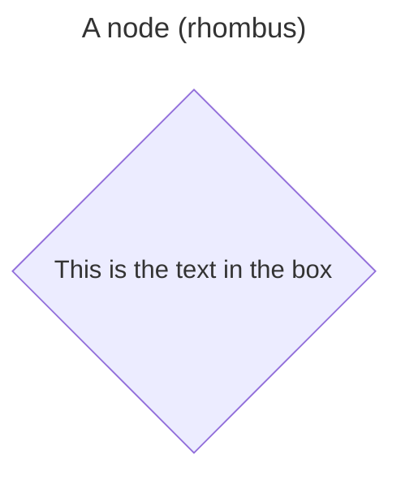

```code
flowchart LR
    id1{This is the text in the box}
```

---

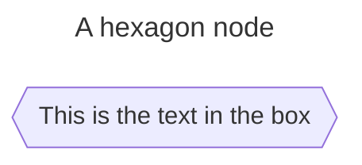

```code
flowchart LR
    id1{{This is the text in the box}}
```

---

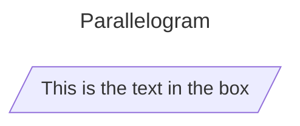

```code
flowchart LR
    id1[/This is the text in the box/]
```

---

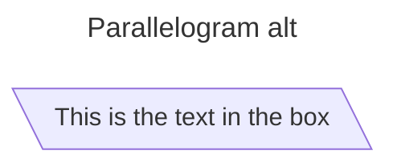

```code
flowchart LR
    id1[\This is the text in the box\]
```

---

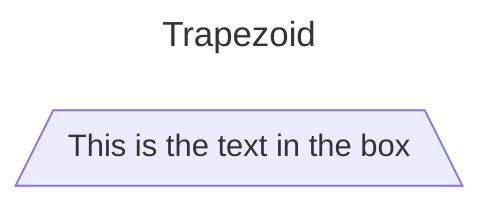

```code
flowchart LR
    id1[/This is the text in the box\]
```

---

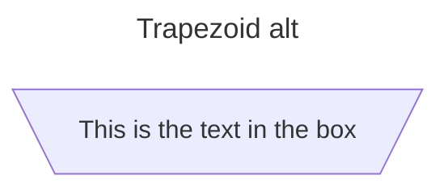

```code
flowchart LR
    id1[/This is the text in the box\]
```

---

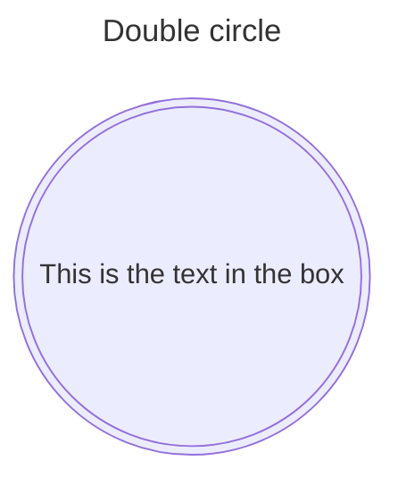

```code
flowchart TD
    idd1(((This is the text in the box)))
```

# Example flowchart with new shapes

---

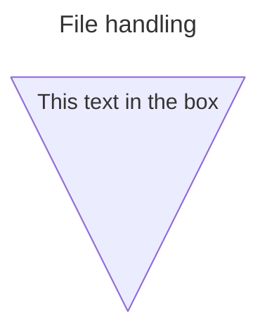

```code
flowchart RL
    A@{shape: manual-file, label: "This text in the box"}
```

---

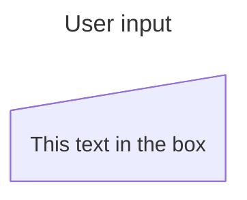

```code
flowchart RL
    A@{shape: manual-input, label: "This text in the box"}
```

---

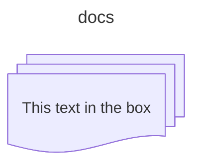

```code
flowchart RL
    A@{shape: manual-file, label: "This text in the box"}
```

---

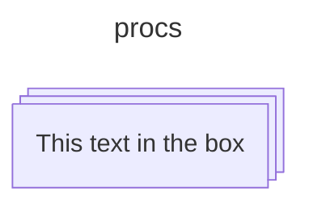

```code
flowchart LR
    A@{shape: procs, label: "This text in the box"}
```

---

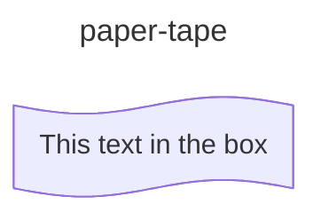

```code
flowchart LR
    A@{shape: paper-tape, label: "This text in the box"}
```

---

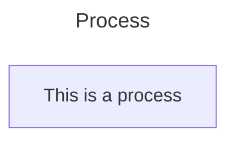

```code
flowchart TD
    A@{shape: rect, label: "This is a process"}
```

---

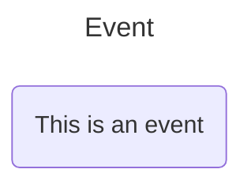

```code
flowchart TD
    A@{shape: rounded, label: "This is an event"}
```

---

```mermaid
---
title: Terminal Point
---
flowchart TD
    A@{shape: stadium, label: "This is an event"}
```

```code
flowchart TD
    A@{shape: stadium, label: "This is an event"}
```

---

```mermaid
---
title: SubProcess
---
flowchart TD
    A@{shape: subproc, label: "This is a subprocess"}
```

```code
flowchart LR
    A@{shape: subproc, label: "This is a subprocess"}
```

---

```mermaid
---
title: Database (cylinder)
---
flowchart TD
    A@{shape: cyl, label: "Database"}
```

```code
flowchart TD
    A@{shape: cyl, label: "Database"}
```

---

```mermaid
---
title: Start (circle)
---
flowchart TD
    A@{shape: circle, label: "Start"}
```

```code
flowchart TD
    A@{shape: circle, label: "start"}
```

---

```mermaid
---
title: Odd
---
flowchart TD
    A@{shape: odd, label: "Odd shape"}
```

```code
flowchart TD
    A@{shape: odd, label: "Odd shape"}
```

---

```mermaid
---
title: Decision (Diamond)
---
flowchart TD
    A@{shape: diamond, label: "Decision"}
```

```code
flowchart TD
    A@{shape: diamond, label: "Decision"}
```

---

```mermaid
---
title: Prepare Conditional
---
flowchart TD
    A@{shape: hex, label: "Prepare conditional"}
```

```code
flowchart TD
    A@{shape: hex, label: "Prepare conditional"}
```

---

```mermaid
---
title: Data Input/Output(Lean Right)
---
flowchart TD
    A@{shape: lean-r, label: "Input/Output"}
```

```code
flowchart TD
    A@{shape: lean-rc, label: "Input/Output"}
```

---

```mermaid
---
title: Data Input/Output (Lean left)
---
flowchart TD
    A@{shape: lean-l, label: "Output/Input"}
```

```code
flowchart TD
    A@{shape: lean-l, label: "Output/Input"}
```

---

```mermaid
---
title: Priority Action(Trapezoid Base Bottom)
---
flowchart TD
    A@{shape: trap-b, label: "Priority action"}
```

```code
flowchart TD
    A@{shape: trap-b, label: "priority action"}
```

---

```mermaid
---
title: Manual Operation(Trapezoid Base Top)
---
flowchart TD
    A@{shape: trap-t, label: "Manual operation"}
```

```code
flowchart TD
    A@{shape: lean-l, label: "Output/Input"}
```

---

```mermaid
---
title: Stop
---
flowchart TD
    A@{shape: dbl-circ, label: "Stop"}
```

```code
flowchart TD
    A@{shape: dbl-circ, label: "Stop"}
```

---

```mermaid
---
title: Text Block
---
flowchart TD
    A@{shape: text, label: "This is a text block"}
```

```code
flowchart TD
    A@{shape: text, label: "This is a text block"}
```

---

```mermaid
---
title: Card
---
flowchart TD
    A@{shape: notch-rect, label: "card"}
```

```code
flowchart TD
    A@{shape: notch, label: "Card"}
```

---

```mermaid
---
title: Lined/Shaded Process
---
flowchart TD
    A@{shape: lin-rect, label: "Lined process"}
```

```code
flowchart TD
    A@{shape: lin-rect, label: "Lined process"}
```

---

```mermaid
---
title: Start(Small Circle)
---
flowchart TD
    A@{shape: sm-circ, label: "Small start"}
```

```code
flowchart TD
    A@{shape: sm-cir, label: "Small start"}
```

---

```mermaid
---
title: Stop(Framed Circle)
---
flowchart TD
    A@{shape: framed-circle, label: "Stop"}
```

```code
flowchart TD
    A@{shape: framed-circle, label: "Stop"}
```

---

```mermaid
---
title: Fork/Join(Long Rectangle)
---
flowchart TD
    A@{shape: fork, label: "Fork or Join"}
```

```code
flowchart TD
    A@{shape: framed-circle, label: "Stop"}
```

---

```mermaid
---
title: Collate(Hourglass)
---
flowchart TD
    A@{shape: hourglass, label: "collate"}
```

```code
flowchart TD
    A@{shape: framed-circle, label: "Stop"}
```

---

```mermaid
---
title: Comment(Curly Brace)
---
flowchart TD
    A@{shape: comment, label: "Comment"}
```

```code
flowchart TD
    A@{shape: comment, label: "Comment"}
```

---

```mermaid
---
title: Comment Right(Curly Brace Right)
---
flowchart TD
    A@{shape: brace-r, label: "Comment"}
```

```code
flowchart TD
    A@{shape: framed-circle, label: "Stop"}
```

---

```mermaid
---
title: Comment with braces on both sides
---
flowchart TD
    A@{shape: braces, label: "Comment"}
```

```code
flowchart TD
    A@{shape: framed-circle, label: "Stop"}
```

---

```mermaid
---
title: Com Link(Lightning Bolt)
---
flowchart TD
    A@{shape: bolt, label: "Communication link"}
```

```code
flowchart TD
    A@{shape: bolt, label: "Communication link"}
```

---

```mermaid
---
title: Document
---
flowchart TD
    A@{shape: doc, label: "Documment"}
```

```code
flowchart TD
    A@{shape: doc, label: "Documment"}
```

---

```mermaid
---
title: Delay(Half-Rounded Rectangle)
---
flowchart TD
    A@{shape: delay, label: "Delay"}
```

```code
flowchart TD
    A@{shape: delay, label: "Delay"}
```

---

```mermaid
---
title: Direct Access Storage(Horizontal Cylinder)
---
flowchart TD
    A@{shape: das, label: "Direct access storage"}
```

```code
flowchart TD
    A@{shape: das ,label: "Disk access storage"}
```

---

```mermaid
---
title: Disk Storage (Lined Cylinder)
---
flowchart TD
    A@{shape: lin-cyl, label: "Disk storage"}
```

```code
flowchart TD
    A@{shape: lin-cyl, label: "Disk storage"}
```

---

```mermaid
---
title: Display(Curved Trapezoid)
---
flowchart TD
    A@{shape: curv-trap, label: "Display"}
```

```code
flowchart TD
    A@{shape: curv-trap, label: "Display"}
```

---

```mermaid
---
title: Divided Process(Divided Rectangle)
---
flowchart TD
    A@{shape: div-rect, label: "Divided process"}
```

```code
flowchart TD
    A@{shape: div-rect, label: "Divided process"}
```

---

```mermaid
---
title: Extract(small Triangle)
---
flowchart TD
    A@{shape: tri, label: "Extract"}
```

```code
flowchart TD
    A@{shape: tri, label: "Extract"}
```

---

```mermaid
---
title: Internal storage (Window Pane)
---
flowchart TD
    A@{shape: win-pane, label: "Internal Storage"}
```

```code
flowchart TD
    A@{shape: win-pane, label: "Internal Storage"}
```

---

```mermaid
---
title: Junction (Filled Circle)
---
flowchart TD
    A@{shape: f-circ, label: "Junction"}
```

```code
flowchart TD
    A@{shape: f-circ, label: "Junction"}
```

---

```mermaid
---
title: LinedDocument
---
flowchart TD
    A@{shape: lin-doc, label: "Lined document"}
```

```code
flowchart TD
    A@{shape: link-doc, label: "Lined document"}
```

---

```mermaid
---
title: Loop Limit(Notched Pentagon)
---
flowchart TD
    A@{shape: notch-pent, label: "loop limit"}
```

```code
flowchart TD
    A@{shape: notch-pent, label: "loop limit"}
```

---

```mermaid
---
title: ManualFile (Flipped Triangle)
---
flowchart TD
    A@{shape: flip-tri, label: "Manual file"}
```

```code
flowchart TD
    A@{shape: flip-trip, label: "Manual file"}
```

---

```mermaid
---
title: Manual Input(Sloped Rectangle)
---
flowchart TD
    A@{shape: sl-rect, label: "Manual input"}
```

```code
flowchart TD
    A@{shape: sl-rect, label: "Manual input"}
```

---

```mermaid
---
title: Multi-Document (Stacked Document)
---
flowchart TD
    A@{shape: docs, label: "Multiple documents"}
```

```code
flowchart TD
    A@{shape: docs, label: "Multiple documents"}
```

---

```mermaid
---
title: Multi-Process (Stacked Rectangle)
---
flowchart TD
    A@{shape: processes, label: "Multiple Process"}
```

```code
flowchart TD
    A@{shape: processes, label: "Multiple Process"}
```

---

```mermaid
---
title: Paper Tape(flag)
---
flowchart TD
    A@{shape: flag, label: "Paper tape"}
```

```code
flowchart TD
    A@{shape: flag, label: "Paper tape"}
```

---

```mermaid
---
title: Stored Data(Bow tie rectangle)
---
flowchart TD
    A@{shape: bow-rect, label: "Stored data"}
```

```code
flowchart TD
    A@{shape: bow-rect, label: "Stored data"}
```

---

```mermaid
---
title: Summary (Crossed Circle)
---
flowchart TD
    A@{shape: cross-circ, label: "Summary"}
```

```code
flowchart TD
    A@{shape: flag, label: "Paper tape"}
```

---

```mermaid
---
title: Tagged Document
---
flowchart TD
    A@{shape: tag-doc, label: "tagged document"}
```

```code
flowchart TD
    A@{shape: tag-doc, label: "tagged document"}
```

---

```mermaid
---
title: Tagged Process(Tagged Rectangle)
---
flowchart TD
    A@{shape: tag-rect, label: "Tagged process"}
```

```code
flowchart TD
    A@{shape: tag-rect, label: "Tagged process"}
```

---

```mermaid
---
title: Summary (Crossed Circle)
---
flowchart TD
    A@{shape: cross-circ, label: "Summary"}
```

```code
flowchart TD
    A@{shape: flag, label: "Paper tape"}
```