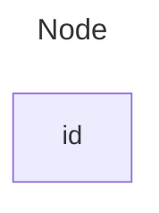
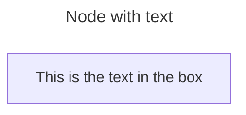
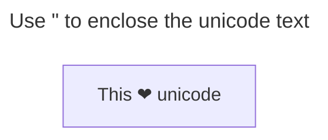
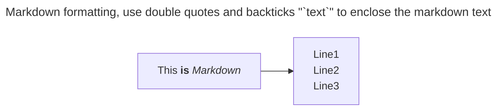
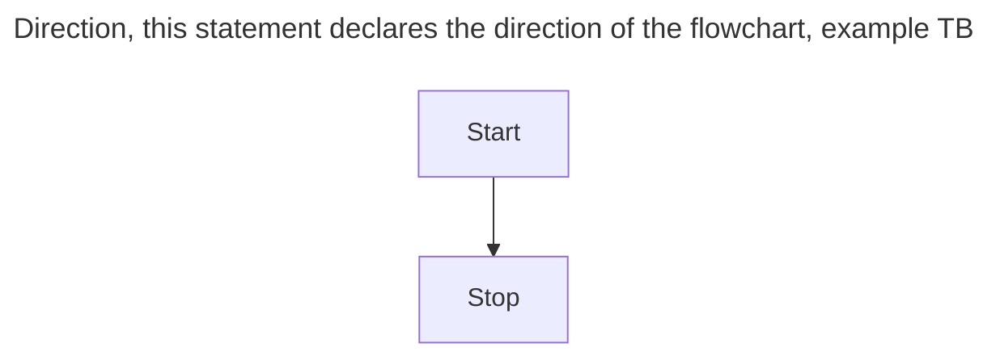
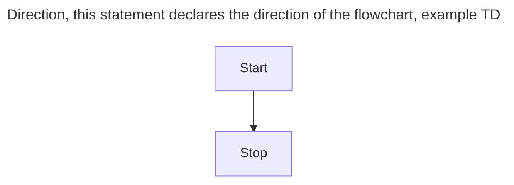
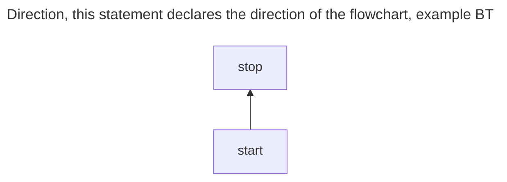
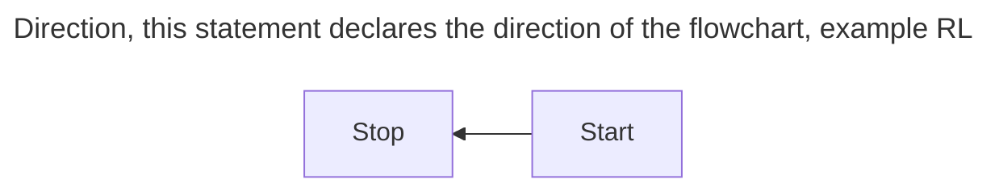
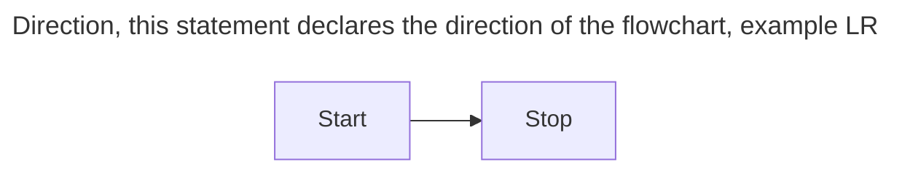

# flowchart

```code
flowchart LR
id
```



---



```code
flowchart LR
    id1[This is the text in the box]
```

---



```code
flowchart LR
    id["this ❤ unicode"]
```

----



```code
%%{ init: {"flowchart": {"htmlLabels": false }} }%%
flowchart LR
    markdown["`this **is** _Markdown_`"]
    newLinux["`Line1
    Line2
    Line3`]
    markdown --> newLinux
```

---



```code
flowchart TB
    Start --> Stop
```

---



```code
flowchart TD
    Start --> Stop
```

----



```code
flowchart BT
    Start --> Stop
```
----



```code
flowchart RL
    Start --> Stop
```

----



```code
flowchart LR
    Start --> Stop
```

[node-shapes](node_shapes.md)