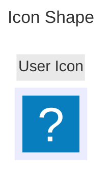

# Special shapes in Mermaid


```text
Parameters
. icon: The name of the icon from the registered pack
. form: Specifies the background to icon. Options include:
    - square 
    - circle
    - rounded
. label: The text label associated with the icon. This can be any string. If not defined, no label will be displayed.
. pos: The position of the label. If not defined label will default to bottom of icon. Possible values are:
    - t
    - b
. h: The height of the icon. If not defined this will default 48 which is minimun
````

---

```mermaid
---
title: Image shape
---
flowchart TD
    A@{ img: "https://salmorejogeek.com/wp-content/uploads/2016/09/tux_kernel_350.jpg", label: "Image Label", pos: "t", w: 0, h:60, constrait: "off" }
```
```text
Parameters
. img: The url of the image to be displayed
. label: The text label associated with the image. This can be any string. If not defined, no label will be displayed
. pos: The posicion of the label. If not defined, the label will default to the bottom of the image. Possible values are:
    - t
    - b
. w: The width of the image. If not defined, this will default to the natural width of the image.
. h: The height of the image. If not defined, this will default to the natural height of the image.
. constraint: Determines if the image should constrain the node size. This setting also ensures the image maintains its original aspect ratio, adjusting the height(h) accordingly to the width(w). if not define, this will default to off posibles values are:
    - on
    - off
````
---
