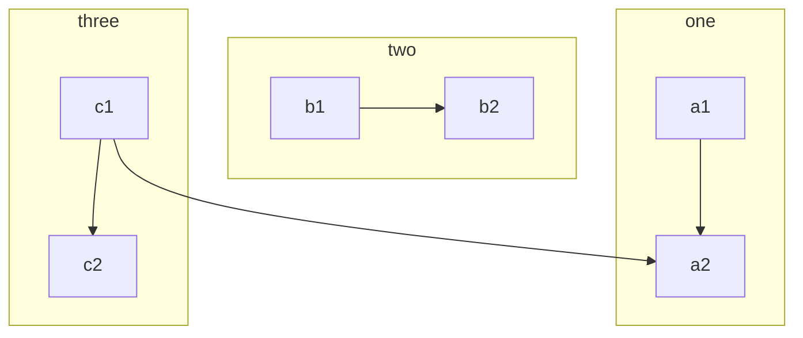
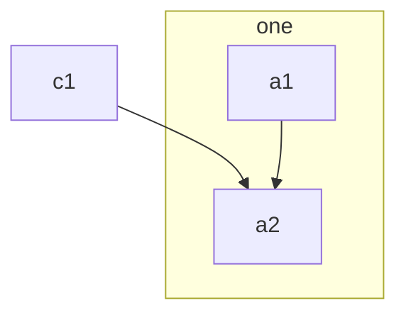
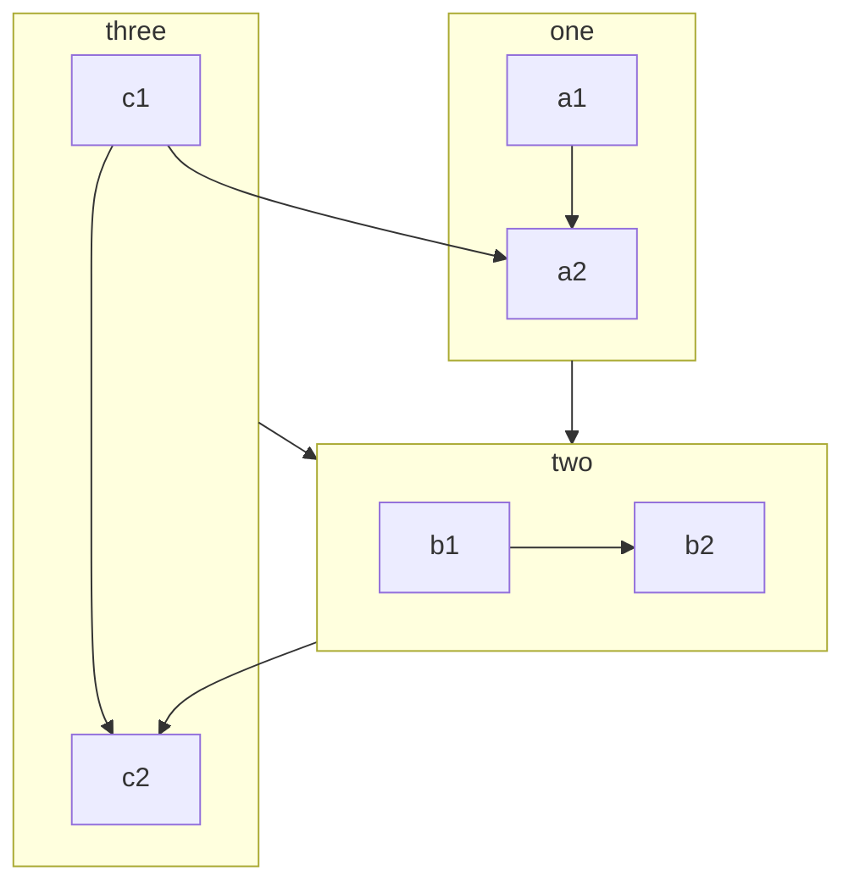
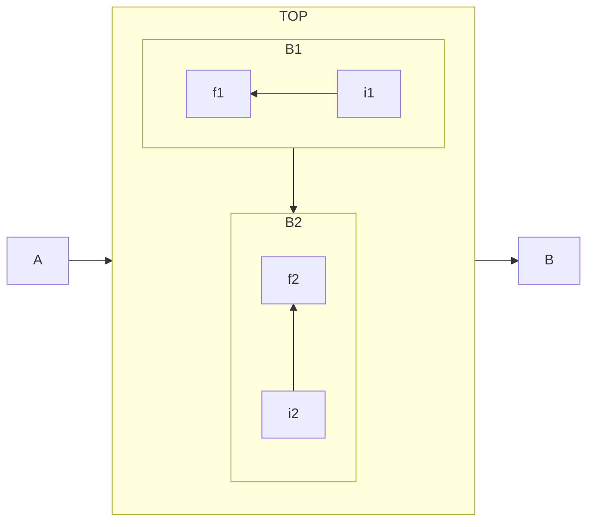
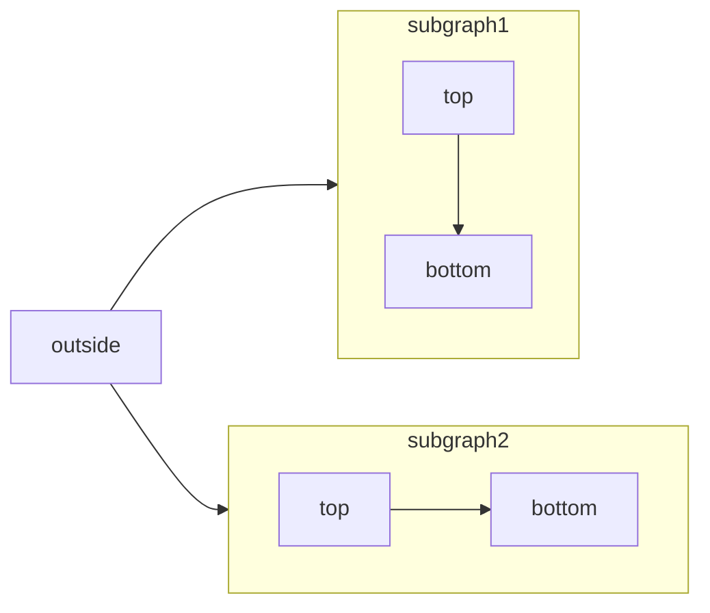

```code
subgraph title
    graph definition
end
```

---


```mermaid
flowchart TB
    c1 --> a2
    subgraph one
        a1 --> a2
    end
    subgraph two
        b1 --> b2
    end
    subgraph three
        c1 --> c2
    end
```

Ejemplo 1:


```mermaid
flowchart TB
    c1-->a2
    subgraph ide1 [one]
        a1-->a2
    end
```

Ejemplo 2:

```mermaid
flowchart TD
    c1 --> a2
    subgraph ide1 [one]
        a1 --> a2
    end
    subgraph ide2 [two]
        b1 --> b2
    end
    subgraph ide3 [three]
        c1 --> c2
    end
    ide1 --> ide2
    ide3 --> ide2
    ide2 --> c2
```

Ejemplo 3:


```mermaid
flowchart LR
    subgraph TOP
      direction TB
        subgraph B1
            direction RL
                i1 --> f1
        end
        subgraph B2
            direction BT
                i2 --> f2
        end
        B1 --> B2
    end
    A --> TOP --> B
```

Ejemplo 4


```mermaid
flowchart LR
    subgraph id1 [subgraph1]
        direction TB
            A[top] --> B[bottom]
    end
    subgraph id2 [subgraph2]
        direction LR
        C[top] --> D[bottom]
    end
    outside --> id1
    outside --> id2
```